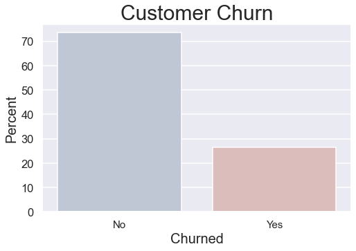
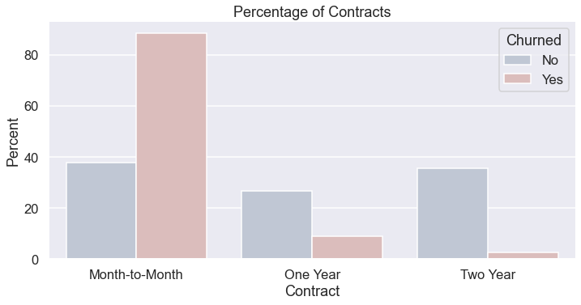
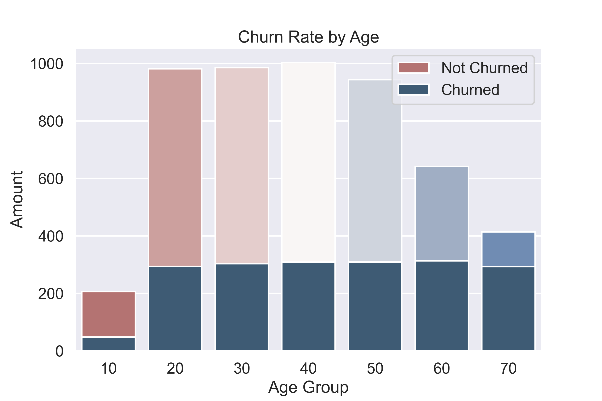
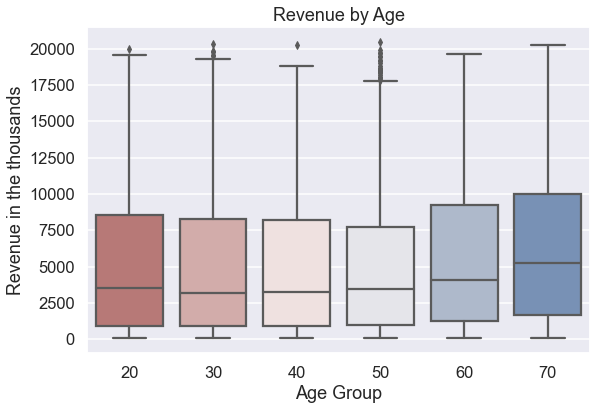
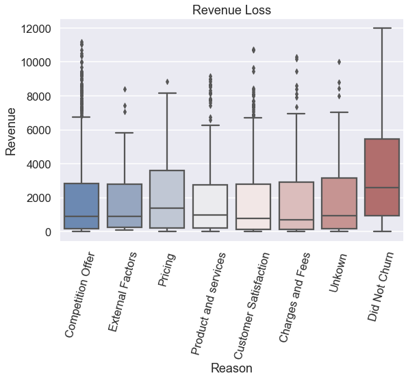
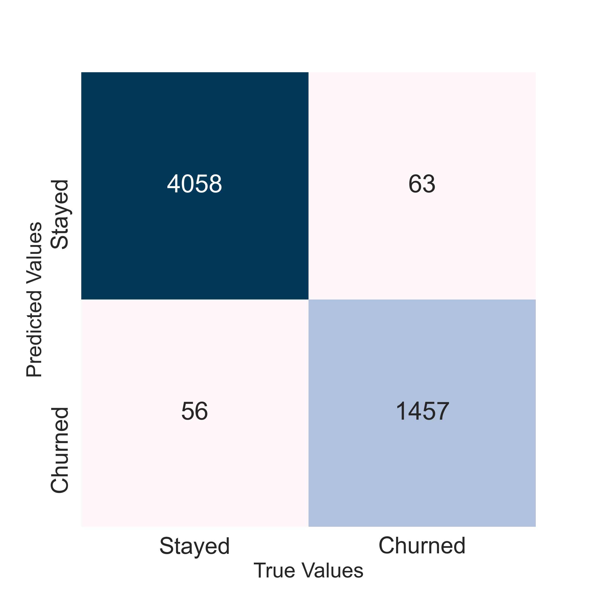
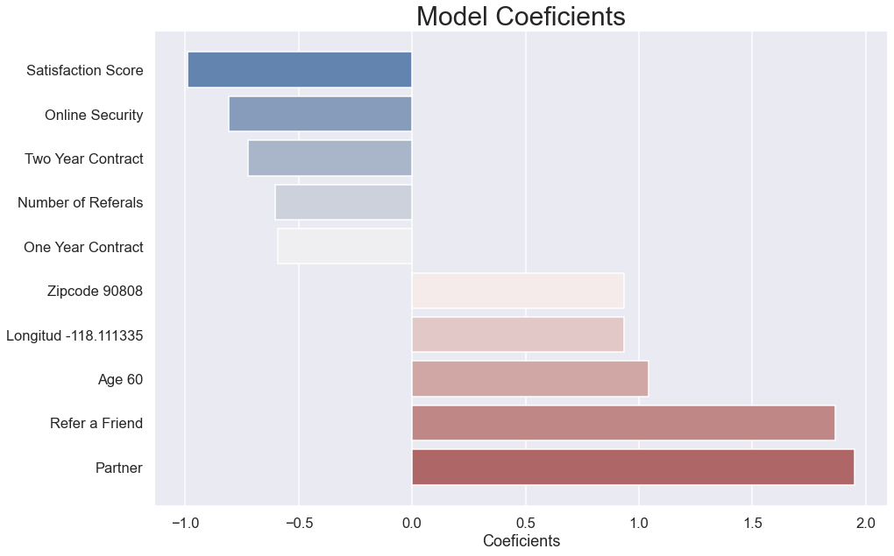

# Customer Churn Prediction.

- Ignacio Ruiz


#### Sources:
[IBM Buisness Analysis Database.](https://community.ibm.com/community/user/businessanalytics/blogs/steven-macko/2019/07/11/telco-customer-churn-1113)

[Google Slides Presentation](https://docs.google.com/presentation/d/1sbrrnp-03OZq6gC47VAPRnK9-BAJgguWWhO5KQsPq78/edit?usp=sharing)

#### File Index:
* #### EDA & Modeling Folder
  - This folder encapsulates all the notebooks that were used for EDA, Modeling and Visualizations. This folder also contains all the data files that were gathered from IBM as well as Fucntions.py file that contains all the written functions that were used in the modeling.
* #### Images Folder
  - This folder contains all the visualizations made that were used in the final presentation and this readme.
* #### Main Notebook.ipyb
  - This is the notebook where the most important components of EDA, Visualizations and Modeling is compiled.
* #### ReadMe


## Introduction

## Business Case

In this trying times, now more than ever, retaining a customer base for a telecommuncations company and maintaining revenue it is of importance. The goal of this project is to help telecomunications companies predict customer churn and maintain revenue. 
With this goal, Telecom Custommer Churn Data was collected from IBM Business Analytics, with data of 7045 customers, all based in California. This data is from the third quarter of the year and contain features such as Churn Reason, Revenue, Total Charges, Type of Contract and more. 

To help in this business case, the following libraries were used:

```
### Data Manipulation
Pandas
Numpy

### Data Visualization
Pandas
Matplotplib.pyplot
Seaborn

### Data Modeling
ScikitLearn

### Models Used
KNN
Logistic Regression
Random Forest
GridSearch
PCA

### Scoring
Accuracy 
F1
```


## Data Collection

The data that was utilized is the Telco customer churn database from IBM Business Analytics. 

The Telco customer churn data contains information about a fictional telco company that provided home phone and Internet services to 7043 customers in California in Q3. It indicates which customers have left, stayed, or signed up for their service. Multiple important demographics are included for each customer, as well as a Satisfaction Score, Churn Score, and Customer Lifetime Value (CLTV) index.

## EDA
Fist I started by looking at my target variable. I wanted to see what was the amount of customers that have churned and those who have not, or people who left the company and those who stayed. I wanted to see what was the class imbalance in the target variable. 



Then I proceeded on looking at what the contracts that the company provided. I wanted to get a sence of what kind of demographics this company was targeting. What I found is that its mostly for Month to Month contracts, witch mean that the company is Prepaid base. 



Next I wanted to get a sense of the customer base, this would give me the indication of what kind of customers we were looking at. The majority of customers seems to be between the ages of 20 - 50. Then I focused on how much each group churned. The numbers do keep consistent for each group. But it seems that the gap is much closer for the older demographic since the customers are far less in those categories.



After I wanted to focus on the revenue, since it is important for prepaid companies to maintain their customer base, and I found out that most of the higher revenue came from the older categories. This gives us the idea that since older customers maintain their older plans they tend to pay more. Followed by the older customers, the ages between 20 and 40 maintain a steady amount of revenue.



Following the revenue, I wanted to look at the potential revenue lost by those who left. I decided to look at how much each category, based on their reason of leaving, project the most loss for the company. And what stood out is that customers who had issues with pricing of the services had brought the most income to the company and seems that they were unhappy with how much they were paying, since they were the ones who stood out the most aside from the ones who left for a better offer, which we could assume since they have the least revenue lost, are more frugal and look for the best bargains.



## Modeling
Following the EDA I wanted to create a model that could help prevent the customer loss and revenue loss. 

#### Initial Models
```
### The initial models that were used were:

* Logistic Regression
  - Accuracy: 0.960526 F1: 0.960526
* KNN
  - Accuracy: 0.309868 F1: 0.379839
* Random Forest
  - Accuracy: 0.874342 F1: 0.883644
```
### Final Model
The final model was created using gridsearch for tunning using the baseline model of Logistic Regression singe it provided with the best Accuracy Score.
```
Logistic Regression with GridSearch Final Scores:
* Accuracy: 0.95
* F1: 0.961
* Recall:0.978
```



I wanted to focus on Accuracy since we want to make sure that the model is able to look at the data and predict with great accuracy a customer that might churn. I also looked at F1 for overall model performance and lastly Recall since I still wanted to minimize the total False Positives that might arise and further prevent company's assets being focused on customers who are not going to churn. 

## Coeficients

Finally I decided to take a look at the coefficients that came out of the GridSearch Logistic Regression model. Since Logistic Regression is calculating by taking using the formula: logit(p)=log(p1−p)=β0+β1x1+...+βxxx, I am able to calculate the odds of a feature being in the positive class by using e^coef-1 when the feature changes by one unit. This could give me an idea of which feature have higher odds on predicting the positive class and negative class.



Viewing at this graph we can see that Satisfaction Score and having a Contract tend to have higher odds on predicting the Negative class as opposed to being Partnered in the company and referring a Friend tend to have higher odds at predicting the positive class.

# Conclussions

In conclusion, in the EDA process, it didn't come as a surprise that customer satisfaction is a key factor in customer retention but what stood out is that, for this company, the majority of revenue loss is from customers who were unhappy with the pricing of services. Also, customers who went with a competitor's best offer could be investigated further to see which products and services is this Telecom company not offering that can be found in its competitors.

Using the each feature coefficients showed us that customers who are in contracts are less likely to churn as well as customers who are happy enough with the company and are willing to refer a friend could mean that they are less likely to churn.

# Future Recommendations 
* Customer satisfaction is a key element in customer retention. Customers are less forgiving when it comes to customer service therefore asking for feedback could hep improve customer retention. This could also be added to a customer's file and use NLP to add more predicting values.
* Use feature coefficients calculate churn risk, with this feature the company can set up a discount strategy for customers who may churn.
* It shows that contracts could maintain customer retention, the company can help providing more cheaper contracts that could lower the customers who have Month-to-Month contracs.
