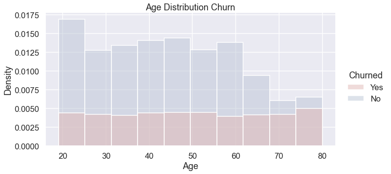
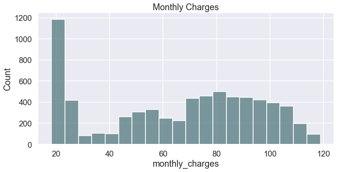
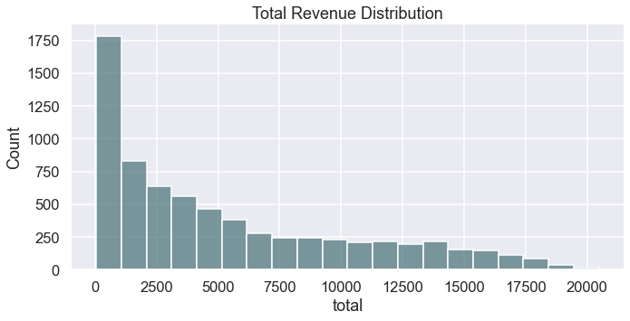
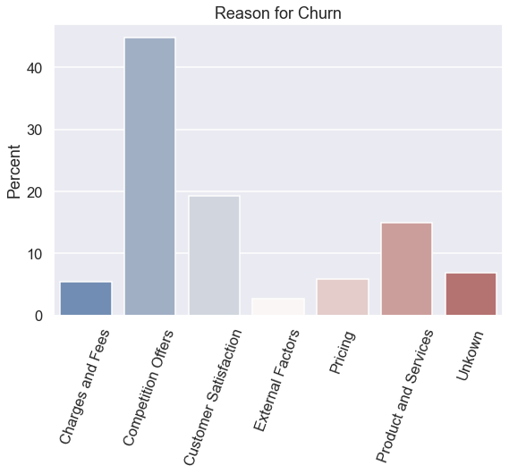
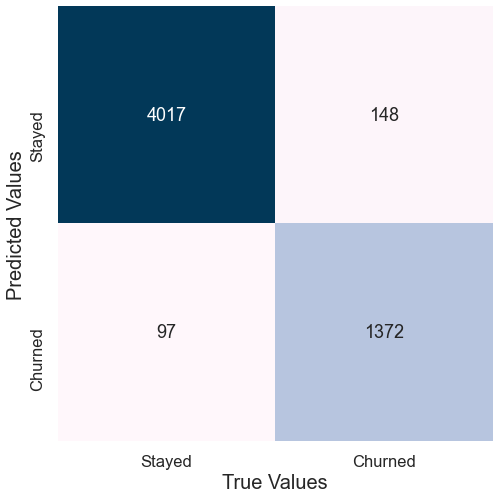
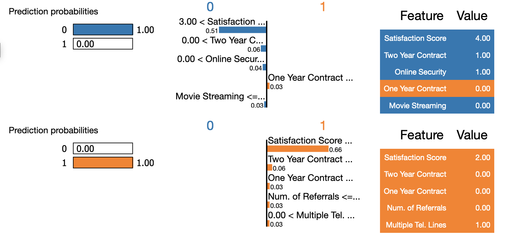

# Customer Churn Prediction.

- Ignacio Ruiz


#### Sources:
[IBM Business Analysis Database.](https://community.ibm.com/community/user/businessanalytics/blogs/steven-macko/2019/07/11/telco-customer-churn-1113)

[IFC, International Finance Corporation.](https://www.ifc.org/wps/wcm/connect/1d490aec-4d57-4cbf-82b3-d6842eecd9b2/IFC-Covid19-Telecommunications_final_web_2.pdf?MOD=AJPERES&CVID=n9nxogP)

[Google Slides Presentation](https://docs.google.com/presentation/d/1sbrrnp-03OZq6gC47VAPRnK9-BAJgguWWhO5KQsPq78/edit?usp=sharing)


## Business Case

Covid-19 has brought challenges and complications to the telecommunications industry. Large corporations, small businesses, and households depend on telecom companies to operate their daily tasks. According to [IEE Communication Society,](https://techblog.comsoc.org/2020/08/27/covid-19-challenges-faced-by-telcos-and-impact-on-the-telecom-sector/)"The unprecedented global health emergency is taxing networks and platforms to the limit, with some operators and platforms reporting demand spikes as high as 800%.”

In the face of the uncertain future, customers are trying to strike a balance between expanding to meet higher demand in the short-term and preserving cash to weather a protracted economic downturn. The [IFC, International Financial Corporation](https://www.ifc.org/wps/wcm/connect/1d490aec-4d57-4cbf-82b3-d6842eecd9b2/IFC-Covid19-Telecommunications_final_web_2.pdf?MOD=AJPERES&CVID=n9nxogP) studies found that lower-income customer groups, who are experiencing the most damage, are expected to reduce or stop purchasing airtime and data bundles. 

With this in mind, Data Science can help mitigate the worries of this Telecommunication Company by focusing on customer churn. Customer churn occurs when your customer or subscriber stops using your product or service within a specific time period. By creating prediction models that can mitigate customer churn, the company can focus on resources and funding into maintaining its infrastructure. Since IFC states: "Infrastructure operators such as tower companies and energy service companies (ESCOs) may see a drop in new contracts."

The model that was implemented to help with the customer churn rate was able to accurately predict a customer will churn 95% of the time. 


## Data Collection

The data that was utilized is the Telco customer churn database from [IBM Business Analytics.](https://community.ibm.com/community/user/businessanalytics/blogs/steven-macko/2019/07/11/telco-customer-churn-1113)

The Telco customer churn data contains information about a fictional telco company that provided home phone and Internet services to 7043 customers in California in Q3. It indicates which customers have left, stayed, or signed up for their service. Multiple important demographics are included for each customer, as well as a Satisfaction Score, Churn Score, and Customer Lifetime Value (CLTV) index.

Some interesting features to note:
* *Churn Value*: Whether or not a person left the telecommunications company.
* *Age*: Age at the time of collecting the data.
* *Total Charge*: In dollars, the amount of money consumers paid to the company in the span of the time they were or still are in the company for online services.
* *Total Revenue*: In dollars, the amount of money consumers paid to the company in the span of the time they were or still are in the company for telephone services.
* *Churn Category*: A high-level category for the customer’s reason for churning: Attitude, Competitor, Dissatisfaction, Other, Price. When they leave the company, all customers are asked about their reasons for leaving. Directly related to Churn Reason.
* *Churn Reason*: A customer’s specific reason for leaving the company. Directly related to Churn Category.
* *Tenure Months*: Indicates the total amount of months that the customer has been with the company by the end of the quarter specified above.
* *Customer Status*: Indicates the status of the customer at the end of the quarter: Churned, Stayed, or Joined

## Exploratory Data Analysis
First I started by looking at my target variable. I wanted to see what was the number of customers that have churned and those who have not, or people who left the company and those who stayed. I wanted to see what was the difference in the percentage of each category to get a sense of how large is the percentage of customer loss for this company.


The results show that currently, the number of customers that have left this company is around 30%. According to [Survicate.com](https://survicate.com/customer-satisfaction/customer-churn/), the average churn rate for American Telecommunications companies is 0.83%. This means that our churn rate is quite high. Although we do have to take into account that this is a small sample and may not portray the full extent of the customer base.

Next, I wanted to look at the types of Contracts the company offers and compare that to the churn of each group. This graph shows the percent distribution of customers that churned and not the percentage of each category's churn.


We can see quite interestingly that for this company, most of the customer base is on a Month-to-Month basis. The main problem is that more of the customers are leaving from the Month-to-Month contracts than any other service offered. One thing to note is that more customers have Two-year contracts than One Year contracts.

This aligns with the current situation that the world is going to. [Pewrsearch.org](https://www.pewresearch.org/internet/2015/04/01/chapter-one-a-portrait-of-smartphone-ownership/) explains that " *Lower-income smartphone owners tend to subscribe to relatively low-cost plans covering only themselves as individuals rather than a higher-cost group or family plans. Accordingly, individual plan subscribers are around twice as likely to have canceled or cut back service as those on group or family plans (34% of individual plan members and 18% of family plan members have done so), and those with relatively low-cost plans are more likely to have canceled or suspended service than those with more expensive plans*." 

This aligns with the data shown above. The higher the commitment or price of plans, the less customer churn is expected.

After getting a sense of the problem the company faces especially during the COVID-19 pandemic, it is clear that there is a high churn rate and most of the customers who have left the company are Month-to-Month customers.  The only demographic describing factor that we have of our customer base is "Sex" and "Age" therefore I wanted to look at the distribution of each customer's age.



The majority of customers seem to be between the ages of 20 - 25, but there is a rapid decline of customers after the age of 60. Looking as well at how much each group churned, the numbers do keep consistent for each group, but a gap is much closer for the older demographic and much larger in the younger demographics.

Now, I want to turn my attention to revenue. Since the majority of clients are on Month-to-Month, I expect that most of the payments are on the lower end. It is important for a company that has a majority of Month-to-Month customer base to improve its revenue as well as maintaining the customer turnaround.



It comes with no surprise that the majority of customers have low monthly charges. This could be due to the fact that most customers are Month-to-Month. There is a higher increase in charges from around 45 to 85 which could be the fact that we have more two-year contracts. 



But now compared to the total revenue the company experienced we see that mostly it concentrates around the bottom part of the graph. As stated before, this could be due to the influence the contracts have on revenue. 

Based on [Pewrsearch.org](https://www.pewresearch.org/internet/2015/04/01/chapter-one-a-portrait-of-smartphone-ownership/) analysis, some 29% of smartphone owners are on an individual plan (which includes pre-paid plans), and most of these users spend less than $100 per month on their cell phone bill. This is especially relevant since we see that the majority of monthly plans are from 20 to 25 dollars. 

After getting a sense of where the revenue of the company was, I wanted to focus on why customers left. By looking at the reason why a customer decided to leave, we can focus efforts on improving that area of services. The following graph shows the percentage of each churn reason.



This graph is giving us a lot of information. We can see that almost 50% of customers left due to competition providing better offers, this is followed by Customer satisfaction. This can give us an idea that in our company, the main reason why customers are leaving is that our competitors are providing better pricing or deals than we are.

According to [The Database Marketing Institute](http://www.dbmarketing.com/telecom/churnreduction.html), Roughly 75 percent of the 17 to 20 million subscribers signing up with a new wireless carrier every year are coming from another wireless provider and hence are already churners. It costs hundreds of dollars to acquire a new customer in most Telecom industries. 


## Modeling
Following the EDA I wanted to create a model that could help prevent customer loss and revenue loss. 

All modeling processes were done in the [Modeling Notebook](EDA_&_Modeling/Modeling_Notebook.ipynb)

Using Accuracy score as the main scoring metric, Recall since we want to minimize the False Positive predictions so the company does not focus on customers that may not churn and F1 to look at the overall model score.

#### Initial Models
```
### The initial models that were used were:

* Logistic Regression
  - Accuracy: 0.992189 F1: 0.775510
* KNN:
  - Accuracy: 0.978934 F1: 0.0
* Random Forest
  - Accuracy: 0.858461 F1: 0.148148
* XGBoost:
  - Accuracy: 0.994319 F1: 0.835616
* Gradient Boost:
  - Accuracy: 0.994319 F1: 0.835616
```

### Final Model
The final model was created using GridSearch for tuning using Gradient Boost as the baseline model.
```
Gradient Boost with GridSearch Final Scores:
* Accuracy: 0.956
* F1: 0.0.902
* Recall:0.918
```
Looking at the final graph that contains all the model predictions and plotted them where we can see the amount of customers the model predicted right and wrong. Since we are looking to prevent customers from canceling their contracts, since we have a heavy turnaround in the Month-to-Month, where we want to minimize is where the model predicted that the customer left but it did not. 



After looking at the results, we can see that the model was able to classify 95% accurately. We were able to have the least number of customers who stayed but were predicted to churn. This is something important when it comes to maintaining a customer base, by reducing the customers who were predicted to leave when they didn't we can reduce company resources in trying to maintain them. Although the numbers are not perfect it can be of great help for this company in reducing the churn rate of its customers.

## Feature Coefficients 

Lastly, I want to explore the feature's importance in each prediction. I took two random customers, one who was predicted to leave and one who was predicted to stay, and viewed each feature that influenced the decision of the model.



By looking at the comparison for each customer we can see that the model views the customer satisfaction score in each decision. The Satisfaction score is on a 1 to 5 scale, where 1 is poor and 5 is great, in the prediction to stay we see that the satisfaction is 4 which is high but in the prediction to leave the satisfaction score is 2 which is low.

We can also see that having a contract (1 meaning Yes and 0 meaning No) the customer who said he did have a contract was predicted to stay and the one who did was predicted to leave. 

Viewing this graph we can see that Satisfaction Score and having a Contract tend to have higher odds on predicting the Negative or Positive Class and it could be explored further.

# Conclussions

In conclusion, in the EDA process, we found that having a Month-to-Month contract greatly influenced the churn rate of the company and that the company suffers from an above-average churn rate for a Telecom company. We also saw that customers who were paying more were the ones who left the company due to pricing but the customers who left due to Competitor's best offer had the most outlying charges and this was confirmed with the majority of customer's reasons for leaving was due to the competition.

Viewing at coefficients showed us that customers who are in contracts are less likely to churn as well as customers who are happy enough with the company and are willing to have online security could mean that they are less likely to churn.

In the end, the company could explore providing affordable One Year contracts for customers who are month to month, as the study from Pewresearch.com shows, most Month-to-Month customers tend to pay less for their contracts and this is a possible avenue to explore. Since in the EDA steps we see that the competition has provided with better offers, having diverse contract options or more flexible services could improve customer retention.

By also using this model and focus on the coefficients of the features, we could create a system that could alert if a customer has a higher chance of churn and the company can focus offers to increase retention rate.

# Future Recommendations 
* Use feature coefficients to calculate churn risk, with this feature the company can set up a discount strategy for customers who may churn.
* The EDA shows that contracts could maintain customer retention, the company can help by providing more cheaper contracts that could lower the customers who have Month-to-Month contracts.
* Pricing could be a great influencing factor for customer churn. By increasing variability in pricing and services, the churn rate for customers could improve.
